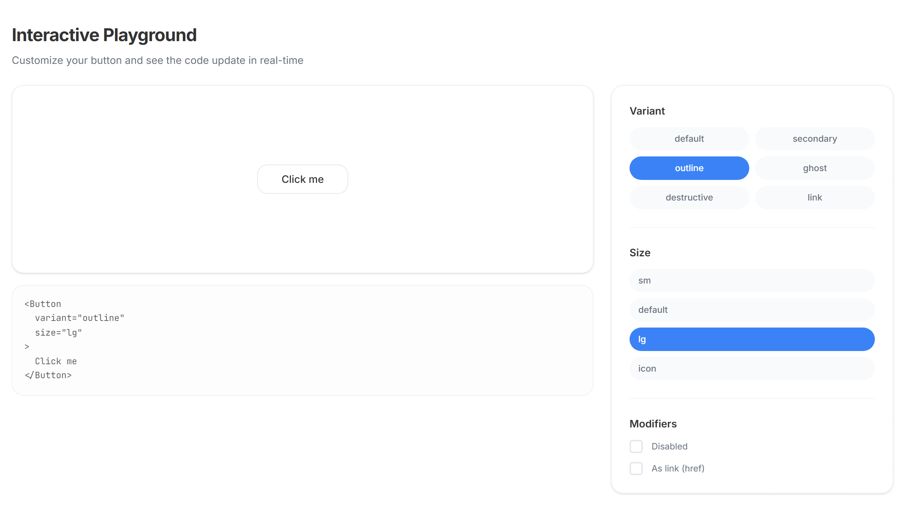
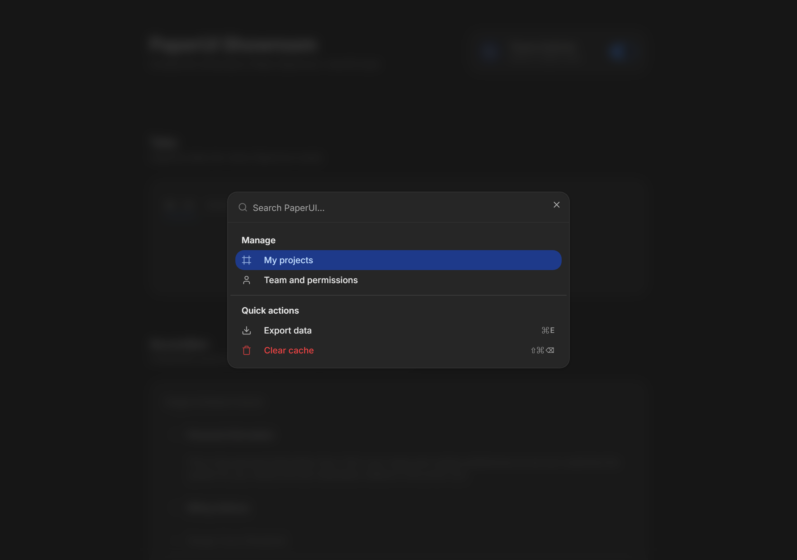

# paperui

_[English](README.md)_

21 komponentów do Svelte 5 - dialogi, dropdowny, tabele, toasty, standard. Oparte na prymitywach bits-ui, ostylowane Tailwindem v4, tryb jasny i ciemny.

Wszystkie komponenty zrobiłem na potrzebę innych projektów, inspirowałem się stylizacją systemów MacOS/Adobe.

**Stack:** Svelte 5 (runy) · SvelteKit · Tailwind v4 · bits-ui · Lucide

## Zrzuty ekranu

Playground buttona.



Paleta poleceń pod ⌘J, w trybie ciemnym.



## Co zawiera

Accordion, alert dialog, badge, button, checkbox, command, dialog, dropdown menu, input, label, paginacja, popover, scroll area, select, sheet, skeleton, switch, tabela, taby, toast, tooltip.

- **bits-ui pod spodem** - obsługa klawiatury, pułapki focusu i ARIA idą z prymitywów, ja dopisuję same klasy.
- **Tokeny zamiast kolorów** - każdy kolor to zmienna OKLCH podana Tailwindowi przez `@theme inline`. Tryb ciemny to te same nazwy z innymi liczbami, więc żaden komponent nie wie, który motyw jest włączony.
- **Klasy da się nadpisać** - wszystko przechodzi przez `cn()` (clsx + tailwind-merge).

## Jak odpalić

```bash
npm install
npm run dev
```

`/` pokazuje wszystkie komponenty na jednej stronie.
