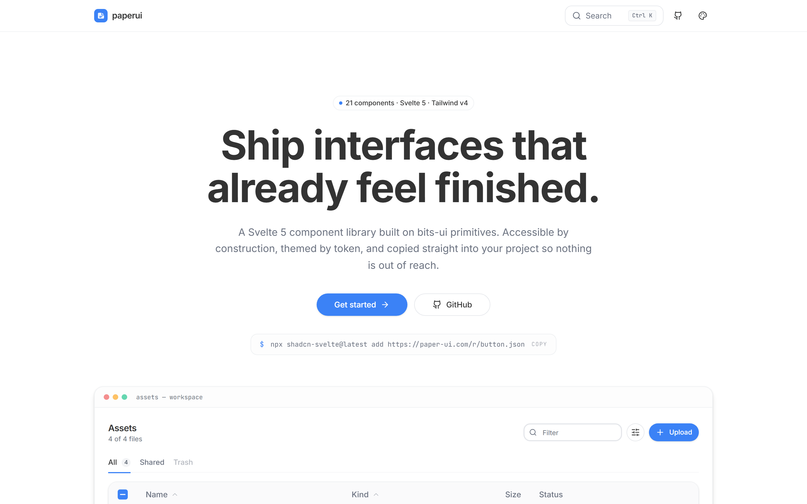
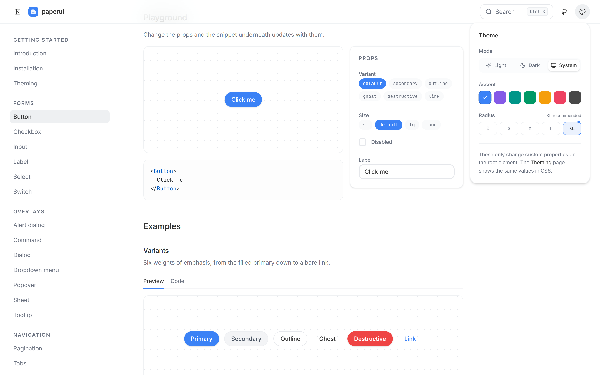

# paperui

_[English](README.md)_

21 komponentów do Svelte 5 - dialogi, dropdowny, tabele, toasty, standard. Oparte na prymitywach bits-ui, ostylowane Tailwindem v4, tryb jasny i ciemny.

Wszystkie komponenty zrobiłem na potrzebę innych projektów i zebrałem je w jednym miejscu.

**Stack:** Svelte 5 (runy) · SvelteKit · Tailwind v4 · bits-ui · Lucide

## Zrzuty ekranu

Strona główna.



Każdy komponent ma playground, w którym snippet nadąża za kontrolkami.


Panel motywu: tryb, gotowe akcenty i skala zaokrągleń.



Wyszukiwarka komponentów pod ⌘K, w trybie ciemnym.


## Co zawiera

Accordion, alert dialog, badge, button, checkbox, command, dialog, dropdown menu, input, label, paginacja, popover, scroll area, select, sheet, skeleton, switch, tabela, taby, toast, tooltip.

- **bits-ui pod spodem** - obsługa klawiatury, pułapki focusu i ARIA idą z prymitywów, ja dopisuję same klasy.
- **Tokeny zamiast kolorów** - każdy kolor to zmienna OKLCH podana Tailwindowi przez `@theme inline`. Tryb ciemny to te same nazwy z innymi liczbami, więc żaden komponent nie wie, który motyw jest włączony.
- **Klasy da się nadpisać** - wszystko przechodzi przez `cn()` (clsx + tailwind-merge).

## Instalacja

Komponenty są wystawione jako rejestr shadcn, więc CLI kopiuje źródła do twojego projektu,
zamiast dokładać zależność. Bazę odpalasz raz:

```bash
npx shadcn-svelte@latest add https://paper-ui.com/r/init.json
```

To instaluje paczki, tworzy `src/lib/utils.ts` z `cn()` i wstawia komplet tokenów - jasne,
ciemne, skalę zaokrągleń i warstwę bazową - do twojego arkusza Tailwinda. Potem dodajesz,
co potrzebujesz:

```bash
npx shadcn-svelte@latest add https://paper-ui.com/r/button.json
```

Komponenty dociągają to, co importują - dodanie `table` przynosi też `checkbox`,
`skeleton` i `scroll-area` - ale zależą wyłącznie od `utils`, więc późniejsza instalacja
nie nadpisze tokenów, które sobie zmieniłeś. Pełny indeks jest pod
[`/registry.json`](https://paper-ui.com/registry.json).

## Jak odpalić dokumentację

```bash
npm install
npm run dev
```

| Ścieżka | Co tam jest |
| --- | --- |
| `/` | Strona główna |
| `/docs` | Wprowadzenie, instalacja, motywy |
| `/docs/components/<nazwa>` | Playground, przykłady, API, skróty klawiszowe |
| `/docs/components/<nazwa>.md` | Ta sama strona jako Markdown |
| `/r/init.json` | Tokeny bazowe, `cn()` i paczki |
| `/r/<nazwa>.json` | Wpis rejestru dla CLI shadcn |
| `/registry.json` | Indeks rejestru |

Każdy przykład na stronie komponentu to prawdziwy plik w `src/lib/docs/examples/`. Strona
go renderuje i pokazuje jego źródło z tego samego pliku, więc nie da się ich rozjechać.

```bash
npm run check   # svelte-check
npm run build   # prerenderuje rejestr i strony .md
npm run shots   # odświeża zrzuty powyżej (dev server musi działać)
```
